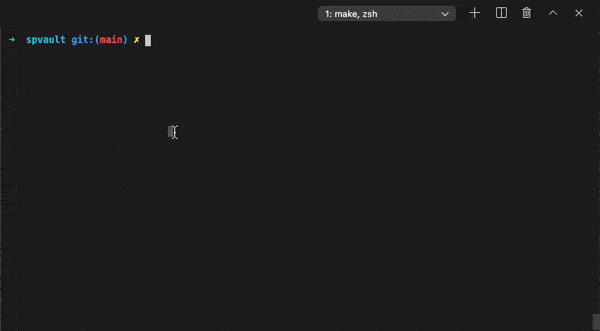

# SPVault - SharePoint Vault

> SharePoint Authentication Vault gPRC server

__Project status: WIP, PoC__

## What the project intends solving

- Provide and abstract SharePoint authentication interface via gPRC.
- Issue SharePoint authentication headers/cookies using client tokens (when a client doesn't know actual credentials).
- Showcase some basic gRPC scenarios together with SharePoint ecosystem.

## Development

### Prerequisites

- Protocol Buffers v3 (`protoc` compiler)
- Go v1.16 or greater
- protoc-gen-go-grpc

#### Installing `protoc`

**On a mac:**

```bash
brew install protobuf
```

**In Windows:**

```bash
choco install protoc
```

#### Installing `protoc-gen-go-grpc`

```bash
go get -u google.golang.org/grpc/cmd/protoc-gen-go-grpc
```

Verify `$GOPATH/bin` is in `PATH` environment variable (`export PATH=$PATH:$GOPATH/bin`).

### Gererate Protobuf

```bash
make generate
```

### Create sertificates

```bash

```

### Run a server

```bash
make server
```

### Run test client (Go)

Create `./config/private.json` corresponding to [gosip auth format](https://go.spflow.com/auth/overview). Add and extra field named "strategy". Use one of the possible strategies: addin, adfs, fba, saml, tmg.

Run client

```bash
make client-go
```

or with a redefined path:

```bash
make client-go private="./config/private.addin.json" scenario=register
make client-go scenario=auth:token token=
make client-dotnet token=
```

Client output contains auth bearer/cookie:

```txt
Token: eyJ0eXAiOiJ...7OqF7sX2J3JfXKZH2keuqLs_boSDEa47vw
Token type: Bearer
Expires on: 2021-01-07 08:24:25 -0600 CST
```

#### Scenarios

Scenario | Command
---------|--------
Register authentication | ```make client-go scenario=register```
Auth with creds         | ```make client-go scenario=auth:creds```
Auth with token         | ```make client-go scenario=auth:token token=9375a36f-049a-41af-aacc-2caac9e20882```
De-Register auth        | ```make client-go scenario=deregister token=9375a36f-049a-41af-aacc-2caac9e20882```

### Run test client (.Net Core)

```bash
make client-dotnet token=32118847-bf0f-4822-9f2a-1bad30077f06
```

Where token value is the one copied from `make client-go scenario=register` output.

## Demo



What's happening here:

1\. Register an authentication:

```bash
make client-go private="./config/private.addin.json" scenario=register
```

`./config/private.addin.json` contains authentication parameters for an Addin:

```json
{
  "siteUrl": "https://contoso.sharepoint.com/sites/site",
  "strategy": "addin",
  "clientId": "924ca7f3-535e-4e12-b0c8-4fec9622107e",
  "clientSecret": "CgnihMbRphqRKXlK0...3t0BF0M7XLlZ/0QCgw="
}
```

Vault server caches the authentication and returns registration ID, its internal identity per the registration.

2\. Go client authenticates with a token:

```bash
make client-go scenario=auth:token token=bf2a33a9-16d3-451f-8dbd-edde15541cb7
```

3\. DotNet Core client authenticates with a token:

```bash
make client-dotnet token=bf2a33a9-16d3-451f-8dbd-edde15541cb7
```

DotNet client authentiation visually takes longer, that's mostly because `dotnet run` is used under the hood and therefore compilation penalty.

4\. Received Bearer tokens can be used in Authentication header to access SharePoint API resources.

A client, which was provided with registration token should also know SharePoint site URL.